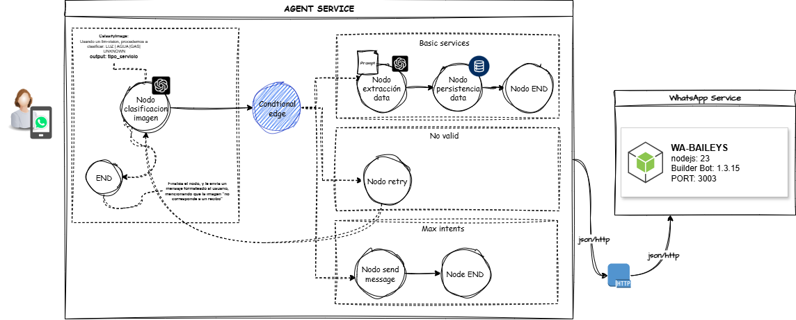

# 🧠 Arquitectura del Agente de Clasificación de Recibos y Recordatorios

## 📌 Descripción General

Este proyecto implementa un **Agente Inteligente basado en LLM** que automatiza la **clasificación de recibos de servicios básicos** (agua, luz y gas) y genera **recordatorios automáticos vía WhatsApp** para informar al usuario sobre sus pagos pendientes o fechas de vencimiento.

El agente utiliza capacidades de **procesamiento de lenguaje natural**, **encadenamiento de prompts (LangChain)** , **creación de agente (langgraph)** y **automatización de notificaciones**, permitiendo una experiencia proactiva y eficiente para la gestión de recibos.

---

## 🤖 Funcionalidades del Agente

- 📄 **Clasificación automática de recibos**
  - Identifica si el recibo corresponde a:
    - Agua
    - Luz
    - Gas
- 🔍 **Extracción de información clave**
  - Monto a pagar
  - Fecha de vencimiento
  - Empresa proveedora
- 🧠 **Procesamiento con LLM (OpenAI + LangChain + Langgraph)**
  - Encadenamiento de prompts para análisis y validación
- 📲 **Generación de recordatorios por WhatsApp**
  - Envío automático de mensajes antes del vencimiento
- 🗂️ **Flujo desacoplado y escalable**
  - Fácil integración con nuevos servicios o canales

---

## 🖼️ Diagrama de Arquitectura

> *(Aquí se incluye el diagrama de arquitectura del agente)*

---
